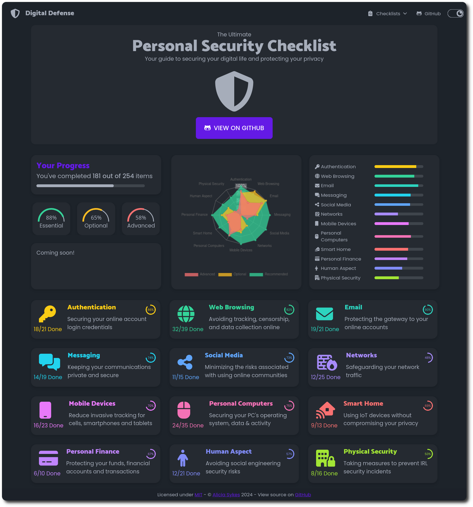

# Mesures à prendre

La protection de sa vie privée en ligne commence par quelques gestes essentiels. Sans être un expert en cybersécurité, chacun peut prendre des mesures simples mais efficaces pour mieux contrôler ses données personnelles et réduire les risques. Voici les bases par lesquelles commencer.

## Les bases essentielles

### 🔑 Protéger ses comptes

#### Gestionnaire de mots de passe

Un gestionnaire de mots de passe est indispensable aujourd'hui. Au lieu de réutiliser le même mot de passe ou de les noter dans un fichier texte, un gestionnaire génère et stocke des mots de passe uniques et complexes pour chaque service. C'est comme avoir un coffre-fort numérique dont vous ne devez retenir que la clé principale.

#### Authentification à multiples facteurs

L'authentification à deux facteurs (2FA) ajoute une couche de sécurité essentielle, mais tous les types de 2FA ne se valent pas. Les codes par SMS sont les plus vulnérables : ils peuvent être interceptés, et les pirates peuvent détourner votre numéro de téléphone via le «SIM swapping». Les codes envoyés par email ne sont pas beaucoup plus sûrs, car si votre email est compromis, tous vos comptes le sont aussi. 

Les applications d'authentification génèrent des codes qui ne transitent jamais sur le réseau, les rendant bien plus sécurisées. Le plus haut niveau de sécurité est offert par les clés de sécurité physiques : de petits appareils USB impossibles à pirater à distance, qui nécessitent une présence physique pour la connexion.

:::tip

La nouvelle génération d'authentification, les passkeys, va encore plus loin. Ces clés numériques, plus sûres que les mots de passe traditionnels, utilisent la biométrie de votre appareil (empreinte digitale ou reconnaissance faciale) pour vous connecter. Contrairement aux codes SMS qui peuvent être interceptés, les passkeys résistent aux attaques de phishing.

:::

### 📱 Auditer ses applications

Vos applications collectent plus d'informations que nécessaire. Prenez le temps de revoir leurs permissions : une application de lampe de poche a-t-elle vraiment besoin d'accéder à vos contacts ? Pour chaque permission demandée (localisation, appareil photo, micro), demandez-vous si elle est réellement nécessaire au fonctionnement de l'application.

### 🛡️ Se protéger des arnaques

Les liens suspects sont la porte d'entrée de nombreuses attaques. Un courriel urgent d'une banque, un message d'un ami qui semble étrange, un texto vous informant d'un colis : prenez l'habitude de vérifier l'expéditeur et l'URL avant de cliquer. En cas de doute, accédez directement au site concerné sans passer par le lien.

Le gel de votre dossier de crédit offre une protection supplémentaire contre l'usurpation d'identité. En gelant l'accès à votre dossier, vous empêchez les fraudeurs d'ouvrir des comptes en votre nom, même s'ils ont vos informations personnelles.

### 👁️ Limiter le traçage en ligne

Les trackers publicitaires vous suivent partout sur internet, construisant un profil détaillé de vos habitudes. Des extensions de navigateur comme uBlock Origin ou Privacy Badger bloquent efficacement ces trackers. Certains navigateurs, comme Firefox ou Brave, intègrent déjà des protections contre le traçage.

### 🎯 Évaluer ses risques personnels

Le «threat modeling» consiste à identifier vos risques spécifiques pour mieux vous protéger. Posez-vous ces questions :

- Quelles sont mes informations les plus sensibles ?
- Qui pourrait vouloir y accéder et pourquoi ?
- Quelles seraient les conséquences d'une fuite ?

Cette réflexion vous permet d'adopter des mesures de protection adaptées à votre situation, sans tomber dans la paranoïa ou la négligence.

## Que faire si vos données ont fuité ?

:::tip

[HaveIBeenPwned](https://haveibeenpwned.com) est un service gratuit qui vous permet de vérifier si vos informations personnelles ont été compromises dans des fuites de données. Le site collecte et indexe les données de brèches de sécurité publiquement connues, permettant à chacun de vérifier si son email ou son mot de passe a été exposé.

:::

- Contacter le DPO (Délégué à la Protection des Données) en consultant la politique de confidentialité du service concerné
- Contacter l'agence gouvernementale de votre région qui s'occupe de la supervision de la protection des données personnelles pour l'organisme concerné

### Pourquoi c'est important ?
Les cybercriminels utilisent ces bases de données de fuites pour :

- Tenter de se connecter à vos autres comptes
- Monter des attaques ciblées de phishing
- Usurper votre identité

## Pour aller plus loin

- [Privacy Guides](privacyguides.org) est une ressource communautaire qui évalue et recommande des outils pour protéger votre vie privée en ligne. Le site se distingue par son approche factuelle et indépendante, proposant des alternatives privées aux services populaires, des guides de configuration détaillés et des analyses approfondies, le tout sans publicité ni monétisation.

- [Digital Defense Initiative](digital-defense.io) est une ressource éducative gratuite et open source qui démystifie la sécurité numérique. Le site propose des tutoriels pratiques et accessibles pour sécuriser vos appareils et protéger votre vie privée au quotidien, avec des contenus régulièrement mis à jour et vérifiés par la communauté.
